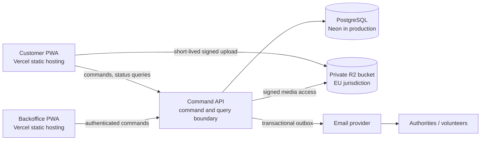

# Animal Helper

Animal Helper is an open-source, non-profit system for reporting suspected
animal cruelty, animals in distress, and injured wildlife, and for helping
volunteers route those reports to the appropriate organisations.

This repository is deliberately **documentation-first**. Product flows and
visual designs are owned by the wider project team and will be integrated when
the Figma work is ready. The current foundation defines the boundaries that make
those screens safe and maintainable.

## System at a glance

- **Customer PWA:** mobile-first, anonymous and offline-capable. A reporter may
  submit a case and later observe its status through an unguessable capability.
- **Backoffice PWA:** desktop/tablet-oriented and authenticated. Administrators
  triage cases, prepare jurisdiction-specific documents, and dispatch reviewed
  communications.
- **Central API:** owns commands, authorisation, workflow transitions,
  projections, and asynchronous jobs.
- **Persistence:** PostgreSQL stores event streams, projections, outbox entries,
  and erasable private data. Private object storage holds media.

The first locale and jurisdiction are Slovak (`sk-SK`, Slovakia), but language
resources and jurisdiction rules are separate packages.



Vercel receives only static application assets. Sensitive case traffic goes
directly to the API and private object storage. This is both a privacy boundary
and a portability choice.

## Repository map

```text
apps/
  customer/       anonymous, offline-capable Vue PWA
  backoffice/     authenticated Vue administration PWA
  api/            HTTP command/status composition root
packages/
  domain/         pure domain types, event evolution, and invariants
  contracts/      versioned transport schemas
  client/         reporter capability, command queue, and HTTP transport
  event-store/    PostgreSQL append/project/outbox adapter
  i18n/           locale dictionaries and lookup, starting with sk-SK
  guidance/       animal-kind catalog, flow templates, and screen map
  jurisdictions/  country-specific routing and form definitions
supabase/          migrations and Edge Function deployment sources
docs/
  architecture/   boundaries, decisions, event model, offline synchronisation
  product/        UI cookbook, case-matrix sources, and screen mapping
  legal/          GDPR requirements, Slovak legal risks, and launch blockers
  security/       security requirements and threat model
  operations/     costs and operational guidance
```

Start with:

- [Architecture overview](docs/architecture/overview.md)
- [Administered guidance flow](docs/architecture/administered-guidance-flow.md)
- [UI cookbook](docs/product/ui-cookbook.md)
- [Case matrices and screen map](docs/product/case-matrices/README.md)
- [GDPR and legal-risk briefing](docs/legal/gdpr-and-legal-risks.md)
- [Delivery plan](docs/roadmap.md)
- [Security requirements](docs/security/security-requirements.md)
- [Threat model](docs/security/threat-model.md)
- [Cost model](docs/operations/cost-model.md)
- [Persistence](docs/operations/persistence.md)
- [Entire checkpoint workflow](docs/operations/entire.md)

## Local development

Node.js 24 LTS and pnpm 11.18.0 are pinned for deterministic builds. pnpm 11
imports `node:sqlite`, which older Node 23 builds (including Homebrew 23.1) do
not provide.

```sh
# Homebrew (keg-only; keep this on PATH in the project shell)
brew install node@24
export PATH="$(brew --prefix node@24)/bin:$PATH"

corepack enable
corepack prepare pnpm@11.18.0 --activate
pnpm install
pnpm check
```

If `pnpm` dies with `Cannot find package node:sqlite`, the `node` on `PATH` is
not 24. Check with `node --version`.

The executable foundation is a framework-free domain core, versioned
case-command contracts, a local PostgreSQL event store, a loopback HTTP API, and
a Vue customer shell for the injured/stray walk.

Local Postgres is Docker Compose (`postgres:16-alpine` on loopback port 55432).
A running Docker Engine with Compose v2 is required. Homebrew Postgres and the
Supabase CLI are not. `npm run dev` starts that container, applies migrations,
serves the API on `http://127.0.0.1:8787`, and serves the customer app on
`http://127.0.0.1:5173`. Ctrl+C stops the API and Vite only; the database stays
up.

```sh
pnpm db:up
npm run dev
```

In another terminal:

```sh
pnpm check
```

Stop the API and Vite with Ctrl+C. Stop the database when you no longer need it:

```sh
pnpm db:down
```

Production uses Neon in a European region. See
[Persistence](docs/operations/persistence.md) and
[ADR 0008](docs/architecture/decisions/0008-docker-local-neon-prod.md).

## Licence

Animal Helper is licensed under
[AGPL-3.0-or-later](https://www.gnu.org/licenses/agpl-3.0.html). This initial
choice keeps hosted improvements available to the community; it should be
confirmed with the future governing organisation before accepting substantial
external contributions.
