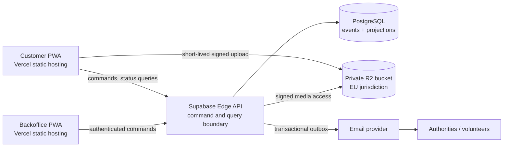

# Animal Helper

Animal Helper is an open-source, non-profit system for reporting suspected
animal cruelty, animals in distress, and injured wildlife, and for helping
volunteers route those reports to the appropriate organisations.

This repository is deliberately **documentation-first**. Product flows and
visual designs are owned by the wider project team and will be integrated when
the Figma work is ready. The current foundation defines the boundaries that make
those screens safe and maintainable.

## System at a glance

- **Customer PWA:** mobile-first, anonymous and offline-capable. A reporter may
  submit a case and later observe its status through an unguessable capability.
- **Backoffice PWA:** desktop/tablet-oriented and authenticated. Administrators
  triage cases, prepare jurisdiction-specific documents, and dispatch reviewed
  communications.
- **Central API:** owns commands, authorisation, workflow transitions,
  projections, and asynchronous jobs.
- **Persistence:** PostgreSQL stores event streams, projections, outbox entries,
  and erasable private data. Private object storage holds media.

The first locale and jurisdiction are Slovak (`sk-SK`, Slovakia), but language
resources and jurisdiction rules are separate packages.



Vercel receives only static application assets. Sensitive case traffic goes
directly to the API and private object storage. This is both a privacy boundary
and a portability choice.

## Repository map

```text
apps/
  customer/       anonymous, offline-capable PWA (implementation follows designs)
  backoffice/     authenticated administration PWA
  api/            Supabase Edge Function/API composition root
packages/
  domain/         pure domain types, event evolution, and invariants
  contracts/      versioned transport schemas
  i18n/           locale dictionaries, starting with sk-SK
  jurisdictions/  country-specific routing and form definitions
supabase/          migrations and Edge Function deployment sources
docs/
  architecture/   boundaries, decisions, event model, offline synchronisation
  legal/          GDPR requirements, Slovak legal risks, and launch blockers
  security/       security requirements and threat model
  operations/     costs and operational guidance
```

Start with:

- [Architecture overview](docs/architecture/overview.md)
- [Administered guidance flow](docs/architecture/administered-guidance-flow.md)
- [GDPR and legal-risk briefing](docs/legal/gdpr-and-legal-risks.md)
- [Delivery plan](docs/roadmap.md)
- [Security requirements](docs/security/security-requirements.md)
- [Threat model](docs/security/threat-model.md)
- [Cost model](docs/operations/cost-model.md)
- [Entire checkpoint workflow](docs/operations/entire.md)

## Local development

Node.js 24 LTS and pnpm 11.18.0 are pinned for deterministic builds.

```sh
nvm use
npm install --global pnpm@11.18.0
pnpm install
pnpm check
```

There are intentionally no deployable user interfaces yet. The initial
executable package is a small framework-free TypeScript domain core that
establishes the project's functional and event-stream conventions.

## Licence

Animal Helper is licensed under
[AGPL-3.0-or-later](https://www.gnu.org/licenses/agpl-3.0.html). This initial
choice keeps hosted improvements available to the community; it should be
confirmed with the future governing organisation before accepting substantial
external contributions.
