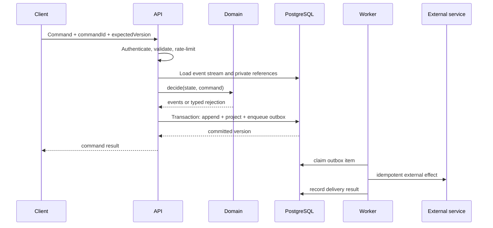

# Architecture overview

Status: **proposed baseline**

Last reviewed: 2026-08-25

This document defines technical boundaries, not product screens. Domain
vocabulary and transitions will be refined with the product team without
changing these boundaries unnecessarily.

## Goals

- Let an anonymous person prepare and submit a report, including while offline.
- Preserve submitted work durably and make retries idempotent.
- Give a small administrator team a secure, auditable backoffice.
- Support reviewed, jurisdiction-specific outbound communication.
- Let administrators maintain a fixed-schema, animal-specific guidance flow
  without making the customer PWA a generic workflow runtime.
- Minimise recurring cost and operational work.
- Keep the system portable between hosting providers.
- Make Slovak the first locale and Slovakia the first jurisdiction without
  hard-coding either into the domain.

## Quality priorities

In order:

1. reporter and subject safety;
2. correctness and recoverability;
3. maintainability by volunteers;
4. low fixed cost;
5. performance.

Expected traffic is tens of people per day. A modular monolith is preferable to
distributed services. Boundaries are represented by packages and adapters and
can be separated only if evidence later justifies it.

## Components and trust boundaries

| Component              | Responsibility                                                        | Trust level                              |
| ---------------------- | --------------------------------------------------------------------- | ---------------------------------------- |
| Customer PWA           | local draft, capture, validation, synchronisation, status display     | untrusted client                         |
| Backoffice PWA         | administration UI                                                     | authenticated but still untrusted client |
| Edge API               | validates commands, authenticates capabilities/admins, applies policy | trusted application boundary             |
| PostgreSQL             | events, projections, private records, audit and outbox                | restricted data store                    |
| Private object store   | original media and safe derived previews                              | restricted data store                    |
| Email provider         | delivery of minimum necessary messages                                | external processor                       |
| Authorities/volunteers | receive administrator-approved communication                          | external recipients                      |

No browser receives database credentials or a provider service-role key.
Row-level security is defence in depth; the API remains the sole public write
boundary for domain commands.

## Deployment baseline

- `apps/customer` and `apps/backoffice`: Vue 3 + Vite static PWAs on Vercel
  ([ADR 0007](decisions/0007-vue-static-pwas.md)). Local `npm run dev` serves
  the customer shell at `http://127.0.0.1:5173`.
- `apps/api` / `supabase/functions`: Supabase Edge Functions (TypeScript/Deno).
- state: Supabase PostgreSQL in a selected European region where available.
- media: private Cloudflare R2 bucket with an EU data-jurisdiction restriction.
- bot challenge: Cloudflare Turnstile, enforced server-side when risk rules
  require it.
- email: a provider adapter, initially evaluated against Resend.

Sensitive report requests do not transit Vercel application functions. The PWAs
call the API directly, and upload media only through narrowly scoped,
short-lived signed URLs. Provider choices are adapters, not domain dependencies.

## Functional command path

The domain layer is framework-free TypeScript:

- `evolve(state, event) -> state`
- `decide(state, command) -> events | domain error`

Time, identifiers, authentication, persistence, email, media, and telemetry are
dependencies supplied at the application edge. We use discriminated unions,
readonly data, exhaustive matching, and explicit result types. We do not
introduce a functional-programming framework until its value exceeds its
onboarding cost.

## Persistence

PostgreSQL is the system of record. Each case has:

- an append-only domain event stream;
- mutable read projections rebuilt from those events;
- erasable private records referenced by opaque identifiers;
- media objects referenced by opaque keys;
- a transactional outbox for external effects.

One database transaction appends events, updates synchronous projections, and
enqueues required effects. A unique `command_id` makes offline retries
idempotent; `(stream_id, stream_version)` provides optimistic concurrency.

See [Domain events](domain-events.md) and
[Data lifecycle](data-and-retention.md), and the
[administered guidance flow](administered-guidance-flow.md).

## Anonymous capability access

A report is not an account. The client generates a cryptographically random
capability with at least 256 bits of entropy. Only its cryptographic hash is
stored server-side.

- Before submission, the capability can mutate the draft and expires no later
  than 30 days after creation.
- After submission, mutation is disabled. The same capability can retrieve only
  a small, sanitised status projection indefinitely.
- A user-supplied email may receive a link containing the capability in the URL
  fragment. The PWA imports it to IndexedDB and immediately removes it from the
  visible URL so it is not sent as an HTTP request, referrer, or analytics
  value.

Capabilities are bearer secrets. Losing one loses access; stealing one grants
the limited access described above. There is no account-recovery process that
would quietly create an identity system.

## Administrator authentication

- no public sign-up;
- individually named, allow-listed accounts;
- mandatory TOTP multi-factor authentication before access to case data;
- server-side assurance-level checks for every privileged endpoint;
- short idle lifetime, bounded absolute session lifetime, and explicit
  revocation;
- audit events for authentication, reads of restricted cases, mutations,
  exports, form generation, recipient changes, and dispatch.

One administrator role is sufficient initially. This does not mean shared
accounts: individual identity is necessary for accountability.

## Outbound communication

Official forms and routing rules are versioned jurisdiction data. An
administrator selects a template, the system creates an editable snapshot from
current case data, and the administrator reviews the exact recipient and content
before dispatch.

Sending is asynchronous through a transactional outbox. Provider message IDs and
idempotency keys prevent double sends. The immutable audit record retains only
delivery metadata after the case's private data is erased.

## Observability

Logs and metrics use allow-listed fields. They never contain request bodies,
capabilities, email addresses, exact locations, media URLs, form contents, or
authorisation headers. Operational correlation IDs are unrelated to reporter
capabilities.

Initial signals:

- accepted/rejected/rate-limited commands by coarse type;
- event append conflicts and projection failures;
- upload slot creation, validation failure, and orphan cleanup counts;
- outbox age and delivery result;
- authentication failures and privileged export volume;
- storage use and provider quota thresholds.

## Explicit non-goals for the first release

- reporter accounts or passwords;
- reporter comments after submission;
- multiple administrator roles;
- microservices, queues, Kubernetes, or a permanently running server;
- search-engine optimisation;
- real-time updates (polling with backoff is sufficient);
- arbitrary user-authored HTML or arbitrary URL fetching;
- a generic workflow engine; the fixed-schema guidance configuration described
  in [Administered guidance flow](administered-guidance-flow.md) is in scope.

The case aggregate is a small, explicit state machine. Generalisation is
deferred until a second proven workflow requires it.
