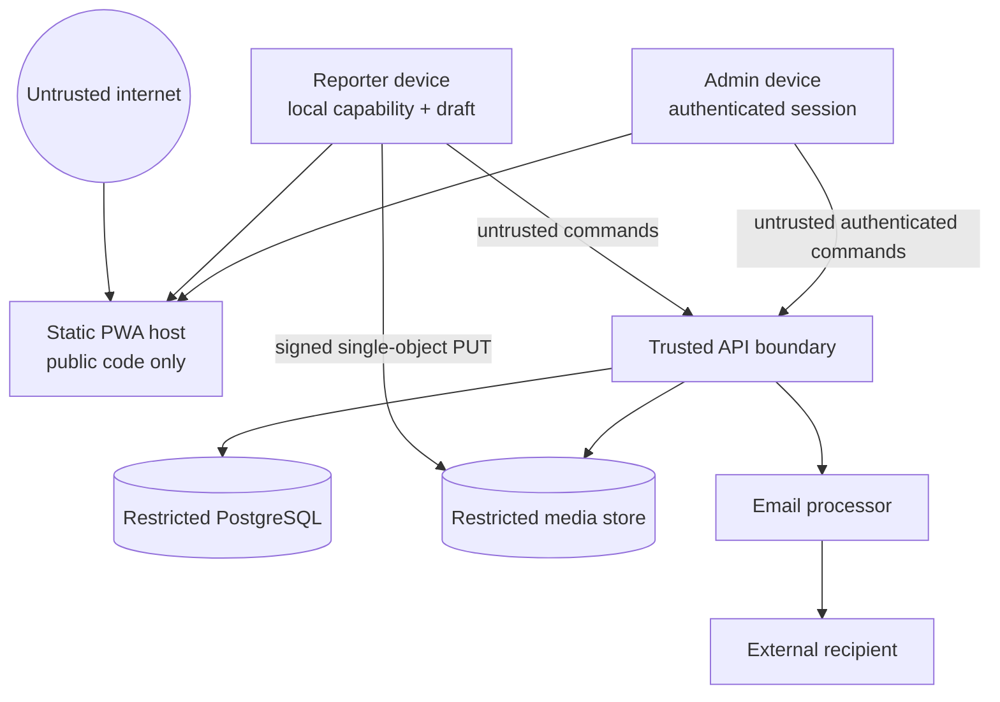

# Threat model

Status: **initial design model**

Method: assets, trust boundaries, misuse cases, and qualitative risk

Review triggers: new data type, provider, role, public endpoint, routing
channel, or material workflow change

Risk ratings assume no controls for inherent risk and the documented controls
for residual risk. `High` residual risks require explicit review before a
real-data pilot.

## Assets and safety properties

| Asset                                      | Required property                                           |
| ------------------------------------------ | ----------------------------------------------------------- |
| Reporter capability and optional email     | confidentiality; unlinkability outside operational need     |
| Report text, location, media, voice        | confidentiality, integrity, bounded retention               |
| Reporter safety                            | no disclosure to an alleged offender or unrelated recipient |
| Case event history and status              | integrity, availability, correct authorisation              |
| Administrator identity/session             | confidentiality, authenticity, accountability               |
| Authority directory/forms/outbound message | integrity, human approval, delivery traceability            |
| Service credentials and signing keys       | confidentiality, rotation, least privilege                  |
| Public statistics                          | useful but non-identifying                                  |

## Relevant adversaries

- opportunistic internet attacker scanning public endpoints;
- spammer or activist flooding the service to exhaust volunteer/provider
  capacity;
- malicious uploader supplying executable, pathological, illegal, or unrelated
  content;
- person implicated by a report attempting to identify or intimidate a reporter,
  erase evidence, or monitor case progress;
- capability thief with access to email, link history, clipboard, or a shared
  device;
- compromised or malicious administrator;
- attacker controlling a dependency, CI action, provider account, or leaked
  secret;
- accidental insider selecting the wrong recipient or exposing a report;
- automated crawler enumerating cases and statistics.

## Trust-boundary diagram

Every arrow crossing into the API or object store is independently
authenticated, validated, bounded, and observable without recording sensitive
content.

## Threat scenarios and treatment

| ID  | Scenario and impact                                                                                     | Inherent risk | Principal controls                                                                                                                  | Residual risk                   |
| --- | ------------------------------------------------------------------------------------------------------- | ------------- | ----------------------------------------------------------------------------------------------------------------------------------- | ------------------------------- |
| T01 | Guess or enumerate a case key to read status or mutate a draft                                          | High          | 256-bit capabilities, hash-only storage, uniform responses, rate limits, no sequential public IDs                                   | Low                             |
| T02 | Capability leaks through URL, analytics, logs, referrer, or email tracking                              | Critical      | fragment transfer, immediate stripping, no third-party scripts/tracking, allow-listed logs, referrer policy                         | Medium                          |
| T03 | Person with email/shared-device access steals the capability                                            | High          | minimal email, no case content after submit, local purge control, device-safety warning                                             | High; inherent to bearer access |
| T04 | Offline retry creates duplicate cases, duplicate transitions, or duplicate emails                       | High          | stable command IDs/content hashes, expected versions, unique constraints, transactional outbox/provider idempotency                 | Low                             |
| T05 | Race between devices overwrites newer draft/state                                                       | High          | optimistic stream version; explicit conflict response/reconciliation; no last-write-wins                                            | Low                             |
| T06 | Flood of reports/media/email exhausts quota, money, or volunteers                                       | High          | hard per-case/type/global caps, staged upload expiry, layered rate limits, Turnstile escalation, spend alerts/circuit breakers      | Medium                          |
| T07 | Uploaded file executes script, exploits parser, or causes decompression/resource exhaustion             | Critical      | format allow-list, magic-byte/size/duration checks, no SVG/HTML/archive, quarantine/scanning, derived previews, attachment download | Medium                          |
| T08 | Stored text executes in backoffice and steals admin session/data                                        | Critical      | text-only rendering, no rich HTML, CSP/Trusted Types where supported, output encoding, short/revocable session                      | Low                             |
| T09 | SQL/command/template injection changes or exfiltrates data                                              | Critical      | strict schemas, parameterised operations, no shell/template evaluation, restricted database role, adversarial tests                 | Low                             |
| T10 | SSRF through media URL, form data, or webhook reaches provider metadata/internal network                | High          | no arbitrary URL fetch/import/webhook in v1, explicit outbound destination allow-list                                               | Low                             |
| T11 | Administrator account takeover exposes all open cases                                                   | Critical      | no sign-up, individual allow-list, mandatory TOTP/AAL check, short sessions, revocation, anomaly audit                              | Medium                          |
| T12 | CSRF or malicious origin performs administrator action                                                  | High          | SameSite, exact CORS/origin checks, anti-CSRF token for cookie auth, re-confirm critical send/export actions                        | Low                             |
| T13 | Malicious/curious admin browses or exports unrelated cases                                              | Critical      | named accounts, least data in list view, read/export audit, volume alerts, no bulk export initially, governance                     | Medium                          |
| T14 | Admin accidentally sends sensitive material to wrong recipient                                          | Critical      | curated directory, recipient/content preview, explicit confirmation, override warning/audit, minimal attachment                     | Medium                          |
| T15 | Attacker changes authority directory or official form                                                   | High          | reviewed versioned jurisdiction packs, protected branch, provenance/version in generated document, diff at review                   | Low                             |
| T16 | Event/projection/outbox divergence loses a transition or sends without an audit trail                   | High          | one DB transaction, constraints, rebuildable projections, outbox reconciliation, invariants/alerts                                  | Low                             |
| T17 | Attacker or operator alters/deletes evidence without trace                                              | Critical      | private immutable object versions during case, content hash, event/audit trail, tightly scoped deletion workflow                    | Medium                          |
| T18 | Personal data persists in immutable events, logs, backups, previews, or provider payloads after closure | Critical      | data separation, allow-listed event/log schemas, deletion orchestration, short retention, DPA/backup mapping, purge tests           | Medium                          |
| T19 | Exact location/EXIF/voice reveals reporter or third party to an unnecessary recipient                   | Critical      | restricted originals, metadata-aware review, safe derived previews, recipient-specific minimisation, administrator warning          | Medium                          |
| T20 | Public statistics/status enable re-identification of rare local reports                                 | High          | sparse status, no location/animal detail, small-cell suppression, delayed/coarsened aggregates, privacy review                      | Low                             |
| T21 | Dependency/CI compromise injects credential or PWA skimmer                                              | Critical      | small dependency set, lockfile, review/updates, read-only CI, pinned Actions before production, CSP, deploy provenance              | Medium                          |
| T22 | Leaked provider key exposes DB, media, or email sending                                                 | Critical      | scoped separate credentials, secret stores/scanning, no browser secrets, rotation/runbook, provider alerts                          | Medium                          |
| T23 | Provider outage or free-tier suspension loses intake or state                                           | High          | offline queue, clear durability state, provider status/runbook, export/restore plan, paid-tier trigger                              | Medium                          |
| T24 | Service worker/cache poisoning keeps a vulnerable app or exposes responses                              | High          | cache only hashed static assets, CSP, update lifecycle tests, no sensitive response cache, emergency unregister path                | Low                             |
| T25 | Email bounce/forwarding exposes a status link to another person                                         | High          | user confirms address, minimal content, capability scope becomes status-only after submit, tracking disabled                        | Medium                          |
| T26 | Attacker uploads unlawful content or fabricates reports to harm a person                                | High          | terms/reporting notice, bounded uploads, administrator quarantine/triage, audit, escalation and deletion procedure                  | Medium                          |
| T27 | IP/risk controls create a new tracking dataset or block vulnerable reporters                            | High          | coarse/short-lived signals, no behavioural advertising, accessible fallback, monitor false positives, never require account         | Medium                          |
| T28 | Free-text or attachments are sent to a generative AI/analytics service unintentionally                  | Critical      | no AI/analytics processing of case data, provider allow-list, egress review, static-only Vercel boundary                            | Low                             |

## High-residual-risk decisions

### Bearer capability on a shared or compromised device

Passwordless cross-device access necessarily creates a transferable secret. The
impact is bounded after submission because only coarse status remains visible.
Before submission, the future UX needs a device-safety explanation and local
purge action. An optional one-time transfer/recovery exchange may be considered
later without changing the capability model.

### Administrator and recipient trust

Technology cannot prove that an administrator has a proper purpose or that an
external mailbox belongs to the intended authority. Individual accountability,
training, a maintained recipient directory, two-step review, minimised content,
and incident procedures are mandatory organisational controls.

### Sensitive media and metadata

Originals may have evidentiary value but can reveal identities, location
metadata, voices, faces, vehicle registrations, or homes. Originals remain
restricted. Previews and outbound material should be derived/minimised, while
any preservation decision is explicit and legally reviewed.

## Abuse and incident hypotheses to exercise

Before pilot, rehearse at least:

1. one network sends hundreds of 20 MB staged uploads;
2. a valid capability is posted publicly;
3. an administrator enters credentials into a phishing page;
4. a malicious image passes extension/MIME checks but not magic-byte validation;
5. an email provider times out after accepting a message;
6. an administrator notices the selected authority address is wrong after send;
7. the deletion worker cannot remove one object;
8. a dependency used by both PWAs is compromised;
9. the database provider is unavailable while an offline reporter submits;
10. a person requests erasure of data contained in another person's report.

Each exercise must produce a decision owner, containment action, evidence that
may be safely retained, notification assessment, and recovery verification.
